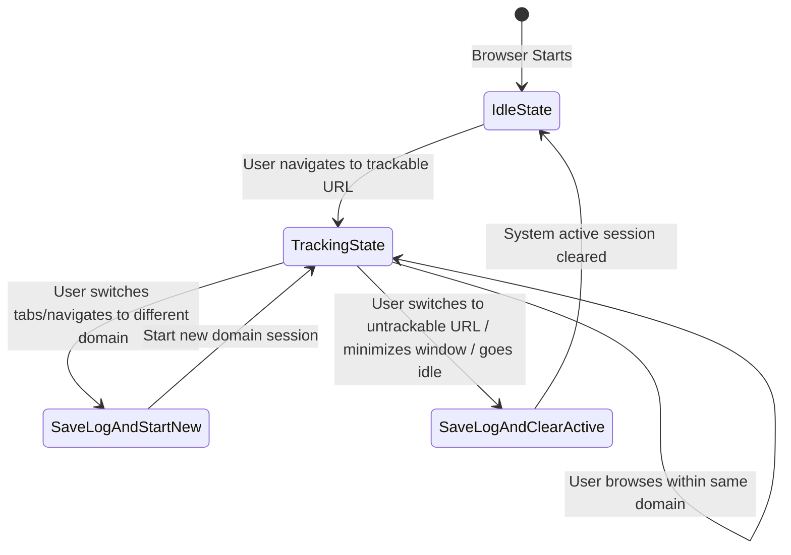

# Architecture Design Document - FocusLens (Phase 1)

This document details the architectural layout, state management, and edge-case handling for Phase 1 of the **FocusLens** browser activity tracking engine.

---

## 1. System Overview

FocusLens tracks user browsing sessions to build productivity and behavior intelligence. In Phase 1, we implement a lightweight, zero-dependency Chrome Extension (Manifest V3) that logs the time a user spends on trackable domains.

The design prioritizes:
- **Accuracy**: Logging the exact duration (in seconds) spent on a website domain.
- **Resilience**: Surving Service Worker restarts or browser crashes without losing state.
- **Privacy & Hygiene**: Filtering out browser internal pages, private schemas, and local files.

---

## 2. Component Design & Interactions

The architecture is highly modular, separating orchestration logic from state and parsing operations.

```
adaptive-browser-intelligence/
 ├── extension/
 │    ├── manifest.json       # Extension metadata, permissions, entry points
 │    ├── background.js       # Core service worker (handles events & state orchestration)
 │    ├── constants.js        # Global configuration constants
 │    ├── utils.js            # Stateless parsing and storage access helper functions
 │    ├── popup.html          # HTML view for toolbar action popup
 │    ├── popup.js            # Toolbar action popup logic (reads stats)
 │    └── icons/              # Extension toolbar & listing icons
 └── docs/
      └── architecture.md     # Architecture documentation (This file)
```

- **`manifest.json`**: Declares Manifest V3 and demands minimum APIs (`storage`, `tabs`, `idle`). Specifies `background.js` as an ES Module service worker (`"type": "module"`).
- **`constants.js`**: Houses system configurations (e.g. `MAX_ACTIVITY_HISTORY: 5000`) and ignore lists. Ensures policies can be modified in one location.
- **`utils.js`**: Provides stateless, testable helpers. Isolates `chrome.storage.local` API usage and URL hostname extraction.
- **`background.js`**: Serves as the central state-machine controller. Translates browser events into tracking transitions.
- **`popup.html` / `popup.js`**: Reads the log count from `chrome.storage.local` and shows the current tracking status to the user.

---

## 3. State Machine & Transition Logic

To handle domain transitions accurately, the system maintains two keys in `chrome.storage.local`:
1. `focuslens_current_session`: Represents the active tab session `{ domain, start_time }`.
2. `focuslens_activity_log`: Contains the array of completed session logs.



### Transition Algorithm
When a tab or focus event fires, `background.js` executes the following check:
1. **Query Active Tab**: Retrieves the active tab in the currently focused window.
2. **Focus Check**: If the browser window does not have focus (e.g. user switches to a native IDE or terminal), the current session is completed and cleared.
3. **URL Validation**: If there is a focused window and active tab:
   - Extract the domain name.
   - If the URL is **untrackable** (e.g. `chrome://extensions` or empty tab):
     - Finalize the active session (if any) and clear it.
   - If the URL is **trackable**:
     - Retrieve `focuslens_current_session` from storage.
     - If `current_session` exists:
       - If `current_session.domain === newDomain`: Do nothing (same session).
       - If `current_session.domain !== newDomain`: Finalize the old session (write to log array) and write a new session entry to storage.
     - If `current_session` does not exist:
       - Write a new session entry `{ domain: newDomain, start_time: now }` to storage.

---

## 4. Service Worker Lifecycle & Resiliency

In Manifest V3, the background script runs as an ephemeral **Service Worker** which Chrome terminates when idle (typically after 30 seconds of inactivity). 

### The In-Memory Variable Trap
Many basic extensions store tracking states (like `activeDomain` and `startTime`) in global JavaScript variables inside `background.js`. If Chrome terminates the service worker while a user is browsing a site, all in-memory variables are lost. When the service worker re-spawns on the next tab switch, it cannot calculate the duration spent on the previous domain.

### FocusLens Persistence Solution
FocusLens avoids this by persisting the active tracking state (`focuslens_current_session`) directly inside `chrome.storage.local`. 
- When `background.js` is spun down, the current tracking state remains intact in Chrome's disk-backed storage.
- When `background.js` wakes up (e.g. on `tabs.onActivated` or `tabs.onUpdated`), it fetches `focuslens_current_session` from storage, compares it to the current tab, and accurately calculates the duration.

---

## 5. Edge-Case Scenarios

| Edge Case | Behavior | Solution / Implementation |
| :--- | :--- | :--- |
| **System Inactivity (Idle)** | Stop tracking when the user leaves the computer. | Listen to `chrome.idle.onStateChanged`. Set the idle threshold to 60 seconds. Finalize and save the session if the user goes `idle` or `locked`. Resume when state returns to `active`. |
| **Browser Out of Focus** | Stop tracking when the user moves to another program. | Listen to `chrome.windows.onFocusChanged`. If the browser window loses focus, finalize the current session and clear the active session. |
| **Invalid/Browser Pages** | Ignore setup pages, blank tabs, and internal schemas. | Check URL via `isValidTrackableUrl()` before processing. Schema exclusions include: `chrome:`, `chrome-extension:`, `edge:`, `about:`, `file:`, `devtools:`, `view-source:`. |
| **Storage Overflow** | Prevent the browser storage from inflating infinitely. | Enforce `MAX_ACTIVITY_HISTORY` (5,000 sessions). When adding a new session, older logs are evicted (FIFO) if the limit is exceeded. |
| **Tab Reloading** | Avoid registering duplicate logs on page refresh. | During a tab update, the tracking state transitions only if the *domain* changes. Reloading the same domain does not reset or duplicate the session. |
